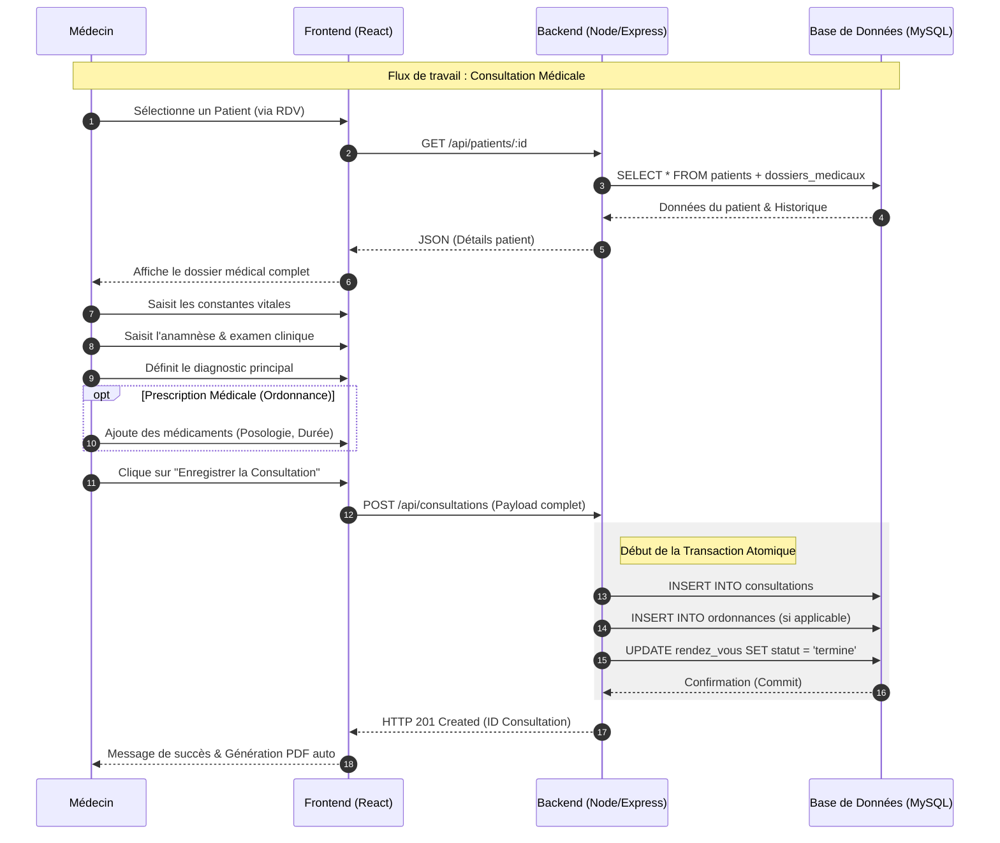

# Diagramme de Séquence - Processus de Consultation

Ce diagramme détaille les échanges techniques entre le Médecin, l'interface Frontend, l'API Backend et la Base de Données lors d'une consultation médicale.

## Description des étapes
1. **Initialisation** : Le médecin accède au dossier du patient via son planning.
2. **Récupération** : Le système charge l'historique pour permettre un suivi éclairé.
3. **Saisie** : Les informations cliniques sont capturées en temps réel.
4. **Transaction** : Le backend garantit que si une étape de l'enregistrement échoue, aucune donnée n'est corrompue (Atomicité).
5. **Finalisation** : Le rendez-vous est marqué comme terminé, libérant le créneau dans l'agenda.
